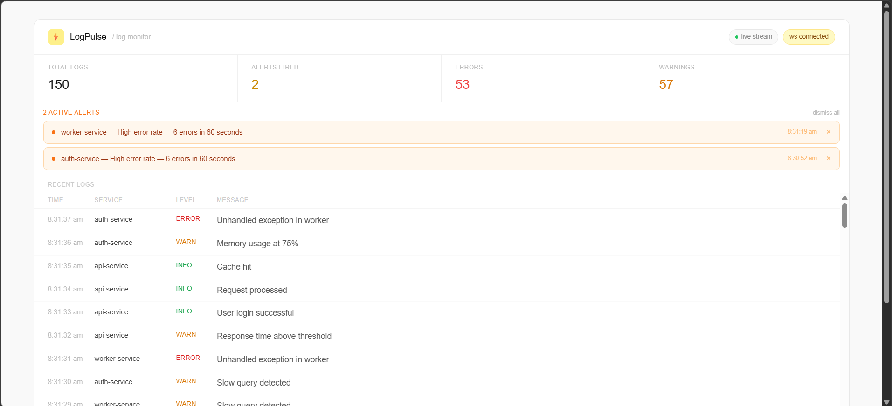
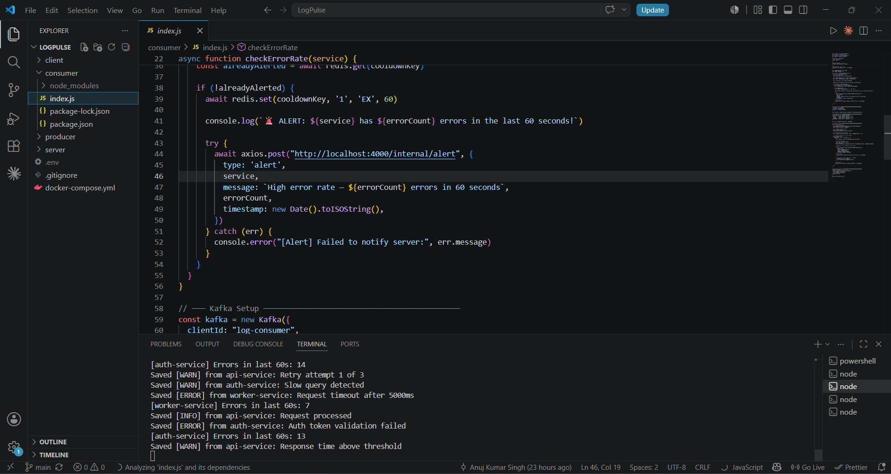
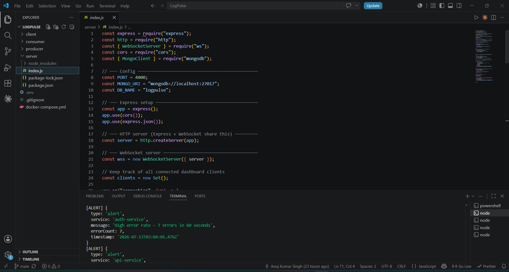

# ⚡ LogPulse

A distributed log monitoring and alerting system built with Apache Kafka, Redis, WebSocket, MongoDB, and React.

LogPulse simulates a real production environment where multiple microservices emit logs continuously. It ingests those logs through Kafka, persists them in MongoDB, detects high error rates using a Redis sliding window, and streams live alerts and logs to a React dashboard over WebSocket.



---

## Architecture

```
Producer → Kafka → Consumer → MongoDB
                       ↓
                     Redis (sliding window alert detection)
                       ↓
                  Express Server
                       ↓
                  WebSocket → React Dashboard
```

Three fake microservices (`auth-service`, `api-service`, `worker-service`) emit logs every second. The consumer processes each log, saves it to MongoDB, and checks if any service has exceeded 5 errors in the last 60 seconds. If it has, an alert fires — once per service per window — and the dashboard updates in real time.

---

## Tech Stack

| Layer | Technology | Why |
|---|---|---|
| Message streaming | Apache Kafka | Decouples log producers from consumers; handles high-throughput log ingestion |
| Alert detection | Redis sorted sets | Sliding window rate limiting — fast, in-memory, TTL-aware |
| Persistence | MongoDB | Flexible schema for log documents; easy time-based querying |
| API + realtime | Express + WebSocket (ws) | REST for historical logs, WebSocket for live push to dashboard |
| Frontend | React + Vite + Tailwind CSS | Fast dev server, component-based UI, utility styling |
| Infrastructure | Docker + Docker Compose | Single command to spin up Kafka, Zookeeper, MongoDB, Redis |

---

## Features

- Live log stream — every log produced appears on the dashboard within 1 second
- Alert detection — Redis sliding window fires an alert when any service exceeds 5 errors in 60 seconds, with a 60-second cooldown to prevent spam
- Historical logs — on page load, the last 100 logs are fetched from MongoDB
- WebSocket auto-reconnect — if the server restarts, the dashboard reconnects automatically within 3 seconds
- Color-coded log levels — INFO green, WARN amber, ERROR red
- Dismissable alerts — individual dismiss or dismiss all
- Stats bar — total logs, alerts fired, errors, warnings

---

## Screenshots

### Dashboard with live logs and active alerts


### Consumer terminal — logs being saved and alerts firing


### Server terminal — WebSocket connections and alert payloads


---

## Project Structure

```
LogPulse/
├── producer/         # Generates fake logs and sends to Kafka
│   └── index.js
├── consumer/         # Reads from Kafka, saves to MongoDB, checks Redis alert window
│   └── index.js
├── server/           # Express REST API + WebSocket server
│   └── index.js
├── client/           # React dashboard
│   └── src/
│       ├── App.jsx
│       └── components/
│           ├── LogTable.jsx
│           └── AlertPanel.jsx
├── docker-compose.yml
└── .env
```

---

## Getting Started

### Prerequisites

- [Node.js](https://nodejs.org/) v18+
- [Docker Desktop](https://www.docker.com/products/docker-desktop/)
- Git

### 1. Clone the repo

```bash
git clone https://github.com/Anuj8506/LogPulse.git
cd LogPulse
```

### 2. Install dependencies

```bash
cd producer && npm install && cd ..
cd consumer && npm install && cd ..
cd server && npm install && cd ..
cd client && npm install && cd ..
```

### 3. Start infrastructure (Kafka, Zookeeper, MongoDB, Redis)

```bash
docker compose up -d
```

Wait 10 seconds for Kafka and Zookeeper to fully initialize.

### 4. Start all services (5 separate terminals)

**Terminal 1 — Server**
```bash
cd server && node index.js
```

**Terminal 2 — Consumer**
```bash
cd consumer && node index.js
```

**Terminal 3 — Producer**
```bash
cd producer && node index.js
```

**Terminal 4 — React client**
```bash
cd client && npm run dev
```

### 5. Open the dashboard

```
http://localhost:5173
```

---

## How the Alert System Works

Every ERROR log triggers a Redis sorted set check for that service:

1. The current timestamp is added to a sorted set keyed by service name (`errors:auth-service`)
2. Entries older than 60 seconds are removed
3. The count of remaining entries is checked
4. If count exceeds 5, a cooldown key is checked (`alerted:auth-service`)
5. If no cooldown exists, an alert fires and the cooldown is set with a 60-second TTL
6. The alert is POSTed to the Express server, which broadcasts it to all WebSocket clients

This means at most one alert per service per 60-second window, regardless of how many errors occur.

---

## API Reference

### `GET /api/logs`
Returns the last 100 logs from MongoDB, sorted newest first.

```json
[
  {
    "service": "auth-service",
    "level": "ERROR",
    "message": "Database connection failed",
    "timestamp": "2026-07-11T06:23:22.098Z"
  }
]
```

### `POST /internal/alert`
Called by the consumer when an alert fires. Broadcasts the alert to all connected WebSocket clients.

### `POST /internal/log`
Called by the consumer for every log. Broadcasts the log to all connected WebSocket clients for live streaming.

---

## Key Engineering Decisions

**Why Kafka instead of directly writing to MongoDB?**
Kafka decouples the producer from the consumer. The producer doesn't need to know or care about MongoDB — it just fires logs into Kafka. This means you can add more consumers later (analytics, archiving, alerting) without touching the producer.

**Why Redis for alert detection instead of querying MongoDB?**
MongoDB queries are disk-based and add latency. Redis sorted sets live in memory and support range queries by score (timestamp) natively — perfect for a sliding time window that needs to be checked on every single ERROR log.

**Why WebSocket instead of polling?**
HTTP polling would require the dashboard to repeatedly ask "any new logs?" every second. WebSocket keeps a persistent connection open so the server can push updates the moment they arrive — lower latency, lower overhead.

---

## What I Learned

This project was my first time working with Kafka, Redis, WebSocket, and Docker. Key takeaways:

- Kafka's consumer group model means you can scale consumers horizontally without duplicating messages
- Redis sorted sets are a natural fit for sliding window rate limiting — `ZADD`, `ZREMRANGEBYSCORE`, and `ZCARD` are all O(log N)
- React 18 StrictMode double-mounts components in development, which creates two WebSocket connections — removing StrictMode fixed duplicate log/alert rendering
- Docker Compose makes it trivial to spin up a multi-service infrastructure locally with a single command

---

## Author

**HARSH KUMAR** — Final year BCA student at MIMT  
[GitHub](https://github.com/Harsh-kr2707)
